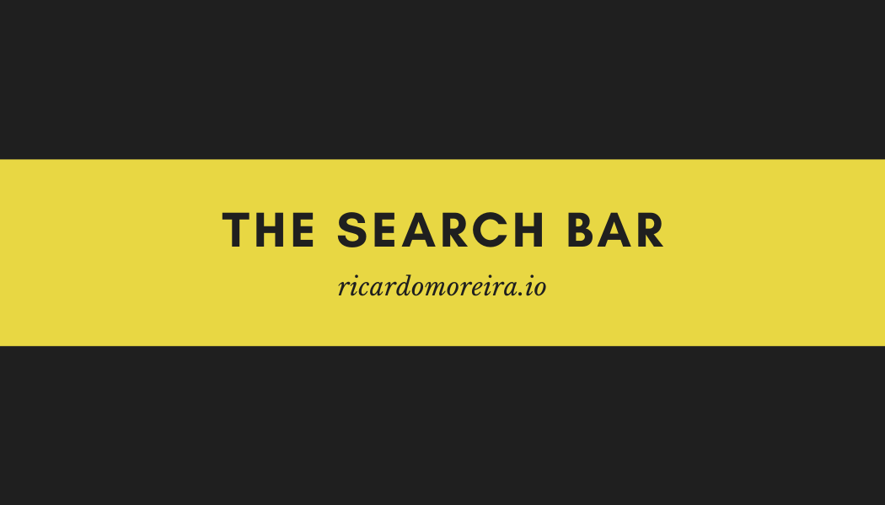
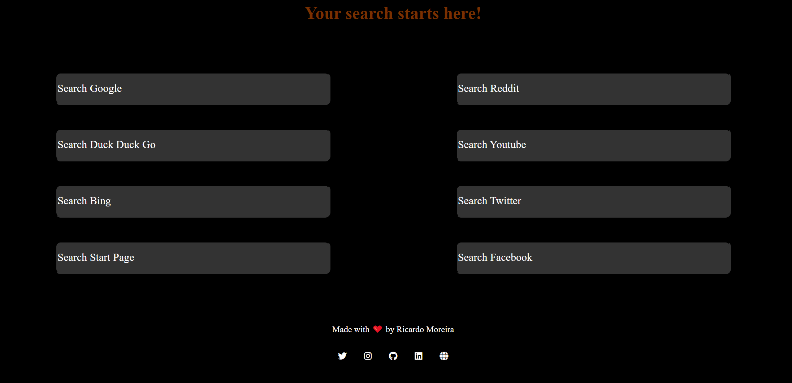
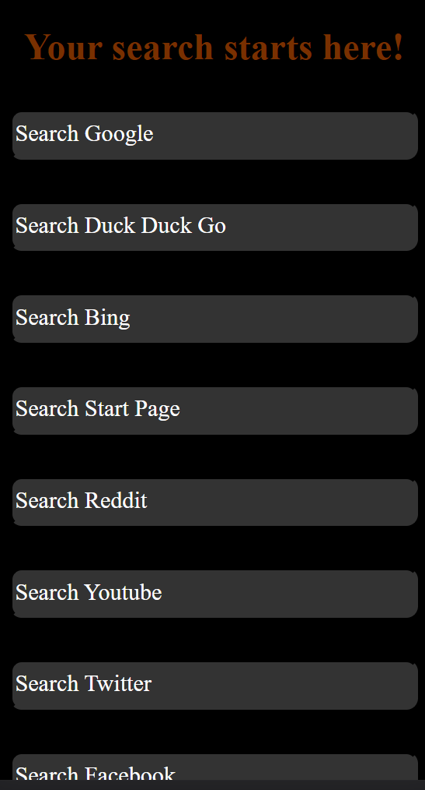

<h1 align="center"> 🔥The Search Bar🔥</h1>

<h2 align="center">One place to search them all</h2>

### Index

- [Name](#Name) 👈
- [Links](#Links) 🔗
- [Description](#Description) 📖
- [Languages and Frameworks](####Languages-and-Frameworks) ⚙️
- [Screenshots](#Screenshots) 📱
- [Instalation](#Instalation) 🧩
- [Support](#Support) 🆘
- [Roadmap](#Roadmap) 🗺️
- [Authors and acknowledgment](####Authors-and-acknowledgment) ✍️
- [Project Status](#Project-Status) 📜

# Name

The search bar

# Links

[Website](https://tyo.netlify.app/)

---

# Description

A simple search form, where you can search all the most important browser and social media

---

# Languages, Frameworks and others

- **HTML** - Framework
- **CSS** - CMS

---

# Screenshots

|             Home Page             |             Blog Page              |
| :-------------------------------: | :--------------------------------: |
|  |  |

---

# Instalation

---

# Support

Have any question or find something that doesn't look good? Let's talk 😊

[Here](https://twitter.com/moreira_creates)

[And Here](https://ricardomoreira.io/about)

---

# Roadmap

---

# Authors-and-acknowledgment

- Ricardo Moreia

- 

---

# Project-Status

Done

---
